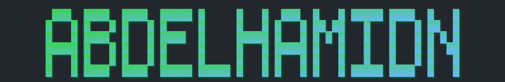

<h3>Cloud &amp; DevOps Project Manager | R&amp;D AI-Oriented Software Engineer</h3>

<em>Turning complex challenges into AI-powered, scalable solutions through multicloud expertise and a passion for deep learning.</em>

  

  

<!-- SKILLS:START -->
**Team & Project Management** 

**Infrastructure & DevOps** 

**Cloud & Systems** 

**Networking & Security** 

**Monitoring & Observability** 

**Data & KPI Reporting** 

![Tableau](https://img.shields.io/badge/-Tableau-E97627?style=flat-square&logo=data:image/svg+xml;base64,PHN2ZyBmaWxsPSJ3aGl0ZSIgcm9sZT0iaW1nIiB2aWV3Qm94PSIwIDAgMjQgMjQiIHhtbG5zPSJodHRwOi8vd3d3LnczLm9yZy8yMDAwL3N2ZyI+PHRpdGxlPlRhYmxlYXU8L3RpdGxlPjxwYXRoIGQ9Ik0xMS42NTQuMTc0VjIuMzc3SDkuNjgydi41OGgxLjk3MlY1LjE2aC42OTZWMi45NTdoMS45N3YtLjU4aC0xLjk3Vi4xNzRoLS4zNDh6bTYuMDMgMi4yNjJsLS4wMDIgMS42MjN2MS42MjNoLTIuOTU3di45MjdoMi45NTd2My4xODhIMTguNzI1bC4wMTEtMS41ODIuMDItMS41NzYgMS40NjUtLjAyIDEuNDYtLjAxdi0uOTI3SDE4LjcyOFYyLjQzNmgtLjUyMnptLTEyLjQwNy4wNlY1LjY4NkgyLjI5MXYuOTI1SDUuMjc3VjkuODAxaC45ODVWNi42MWgzLjAxM3YtLjkyNUg2LjI2MlYyLjQ5Nkg1Ljc3em02LjA4NiA1LjI3djMuNTkzSDguMDZ2MS4xODhoMy4zMDR2My41OTZoMS4yOHYtMy41OTZIMTUuOTUzdi0xLjE4OEgxMi42NDNWNy43NjZoLS42Mzd6bTkuNzIxIDEuNTV2Mi4yMjFoLTIuMDEydi44MTFoMi4wMTJ2Mi4yNjFoLjg4N3YtMi4yNjFIMjR2LS44MTFoLTIuMDI5VjkuMzE3aC0uNDIyem0tMTkuMTExLjEzMVYxMS42MjFIMHYuNjIxSDEuOTczdjIuMTk0SDIuNjR2LTIuMTk0aDJ2LS42MkgyLjYwOVY5LjQ0NmgtLjMxOHptMTUuNzA5IDQuNTE2djMuMjU0aC0zLjAxNnYuOTI3aDMuMDE2djMuMjE3aDEuMDcydi0zLjIxNkgyMS43NHYtLjkyOEgxOC43NTR2LTMuMjU0aC0uNTMzem0tMTIuNDYzLjAwOHYzLjI0NkgyLjI2MnYuOTI4aDIuOTU3djMuMTg5SDYuMzJ2LTMuMTg5aDIuOTU1di0uOTI4SDYuMzJWMTMuOTdoLS41NXptNi4zMTYgNC41NzhsLjAwMiAxLjEwM3YxLjFIOS41NjZ2LjgxMmgxLjk3MXYyLjI2MmguOTI4bC4wMTItMS4xMTkuMDE3LTEuMTQzSDE0LjQ2M3YtLjgxMmgtMlYxOC41NDloLS40NjV6Ii8+PC9zdmc+&logoColor=white)

**Automation, APIs & AI** 

![OpenAI API](https://img.shields.io/badge/-OpenAI_API-412991?style=flat-square&logo=data:image/svg+xml;base64,PHN2ZyBmaWxsPSJ3aGl0ZSIgcm9sZT0iaW1nIiB2aWV3Qm94PSIwIDAgMjQgMjQiIHhtbG5zPSJodHRwOi8vd3d3LnczLm9yZy8yMDAwL3N2ZyI+PHRpdGxlPk9wZW5BSTwvdGl0bGU+PHBhdGggZD0iTTIyLjI4MTkgOS44MjExYTUuOTg0NyA1Ljk4NDcgMCAwIDAtLjUxNTctNC45MTA4IDYuMDQ2MiA2LjA0NjIgMCAwIDAtNi41MDk4LTIuOUE2LjA2NTEgNi4wNjUxIDAgMCAwIDQuOTgwNyA0LjE4MThhNS45ODQ3IDUuOTg0NyAwIDAgMC0zLjk5NzcgMi45IDYuMDQ2MiA2LjA0NjIgMCAwIDAgLjc0MjcgNy4wOTY2IDUuOTggNS45OCAwIDAgMCAuNTExIDQuOTEwNyA2LjA1MSA2LjA1MSAwIDAgMCA2LjUxNDYgMi45MDAxQTUuOTg0NyA1Ljk4NDcgMCAwIDAgMTMuMjU5OSAyNGE2LjA1NTcgNi4wNTU3IDAgMCAwIDUuNzcxOC00LjIwNTggNS45ODk0IDUuOTg5NCAwIDAgMCAzLjk5NzctMi45MDAxIDYuMDU1NyA2LjA1NTcgMCAwIDAtLjc0NzUtNy4wNzI5em0tOS4wMjIgMTIuNjA4MWE0LjQ3NTUgNC40NzU1IDAgMCAxLTIuODc2NC0xLjA0MDhsLjE0MTktLjA4MDQgNC43NzgzLTIuNzU4MmEuNzk0OC43OTQ4IDAgMCAwIC4zOTI3LS42ODEzdi02LjczNjlsMi4wMiAxLjE2ODZhLjA3MS4wNzEgMCAwIDEgLjAzOC4wNTJ2NS41ODI2YTQuNTA0IDQuNTA0IDAgMCAxLTQuNDk0NSA0LjQ5NDR6bS05LjY2MDctNC4xMjU0YTQuNDcwOCA0LjQ3MDggMCAwIDEtLjUzNDYtMy4wMTM3bC4xNDIuMDg1MiA0Ljc4MyAyLjc1ODJhLjc3MTIuNzcxMiAwIDAgMCAuNzgwNiAwbDUuODQyOC0zLjM2ODV2Mi4zMzI0YS4wODA0LjA4MDQgMCAwIDEtLjAzMzIuMDYxNUw5Ljc0IDE5Ljk1MDJhNC40OTkyIDQuNDk5MiAwIDAgMS02LjE0MDgtMS42NDY0ek0yLjM0MDggNy44OTU2YTQuNDg1IDQuNDg1IDAgMCAxIDIuMzY1NS0xLjk3MjhWMTEuNmEuNzY2NC43NjY0IDAgMCAwIC4zODc5LjY3NjVsNS44MTQ0IDMuMzU0My0yLjAyMDEgMS4xNjg1YS4wNzU3LjA3NTcgMCAwIDEtLjA3MSAwbC00LjgzMDMtMi43ODY1QTQuNTA0IDQuNTA0IDAgMCAxIDIuMzQwOCA3Ljg3MnptMTYuNTk2MyAzLjg1NThMMTMuMTAzOCA4LjM2NCAxNS4xMTkyIDcuMmEuMDc1Ny4wNzU3IDAgMCAxIC4wNzEgMGw0LjgzMDMgMi43OTEzYTQuNDk0NCA0LjQ5NDQgMCAwIDEtLjY3NjUgOC4xMDQydi01LjY3NzJhLjc5Ljc5IDAgMCAwLS40MDctLjY2N3ptMi4wMTA3LTMuMDIzMWwtLjE0Mi0uMDg1Mi00Ljc3MzUtMi43ODE4YS43NzU5Ljc3NTkgMCAwIDAtLjc4NTQgMEw5LjQwOSA5LjIyOTdWNi44OTc0YS4wNjYyLjA2NjIgMCAwIDEgLjAyODQtLjA2MTVsNC44MzAzLTIuNzg2NmE0LjQ5OTIgNC40OTkyIDAgMCAxIDYuNjgwMiA0LjY2ek04LjMwNjUgMTIuODYzbC0yLjAyLTEuMTYzOGEuMDgwNC4wODA0IDAgMCAxLS4wMzgtLjA1NjdWNi4wNzQyYTQuNDk5MiA0LjQ5OTIgMCAwIDEgNy4zNzU3LTMuNDUzN2wtLjE0Mi4wODA1TDguNzA0IDUuNDU5YS43OTQ4Ljc5NDggMCAwIDAtLjM5MjcuNjgxM3ptMS4wOTc2LTIuMzY1NGwyLjYwMi0xLjQ5OTggMi42MDY5IDEuNDk5OHYyLjk5OTRsLTIuNTk3NCAxLjQ5OTctMi42MDY3LTEuNDk5N1oiLz48L3N2Zz4=&logoColor=white)

![Microsoft 365](https://img.shields.io/badge/-Microsoft_365-D83B01?style=flat-square&logo=data:image/svg+xml;base64,PHN2ZyBmaWxsPSJ3aGl0ZSIgcm9sZT0iaW1nIiB2aWV3Qm94PSIwIDAgMjQgMjQiIHhtbG5zPSJodHRwOi8vd3d3LnczLm9yZy8yMDAwL3N2ZyI+PHRpdGxlPk1pY3Jvc29mdCBPZmZpY2U8L3RpdGxlPjxwYXRoIGQ9Ik0yMS41MyA0LjMwNnYxNS4zNjNxMCAuODA3LS40NzIgMS40MzMtLjQ3Mi42MjctMS4yNTMuODVsLTYuODg4IDEuOTc0cS0uMTM2LjAzNy0uMjkuMDU1LS4xNTYuMDE5LS4yOTMuMDE5LS4zOTYgMC0uNzItLjEwNS0uMzIxLS4xMDYtLjY1Ni0uMjkybC00LjUwNS0yLjU0NHEtLjI0OC0uMTM3LS4zOTEtLjM2Ni0uMTQzLS4yMy0uMTQzLS41MTUgMC0uNDM0LjMwNC0uNzM4LjMwNC0uMzA1LjczOS0uMzA1aDUuODMxVjQuOTY0bC00LjM4IDEuNTYzcS0uNTMzLjE4Ny0uODU2LjY1OC0uMzIyLjQ3Mi0uMzIyIDEuMDN2OC4wNzhxMCAuNDk2LS4yNDguOTEyLS4yNS40MTYtLjY4My42NTFsLTIuMDcyIDEuMTNxLS4yODYuMTQ4LS41NzEuMTQ4LS40OTcgMC0uODQ0LS4zNDctLjM0OC0uMzQ3LS4zNDgtLjg0NFY2LjU2M3EwLS42Mi4zMy0xLjE5LjMyOC0uNTcxLjg3NC0uODgxTDExLjA3LjI4NXEuMjQ4LS4xMzYuNTM0LS4yMS4yODUtLjA3NS41Ny0uMDc1LjIxMSAwIC4zOC4wMzEuMTY2LjAzMS4zNjQuMDkzbDYuODg4IDEuODk5cS4zODQuMTEuNy4zMjkuMzE3LjIxNy41NDcuNTIuMjMuMzA1LjM1My42Ny4xMjUuMzY3LjEyNS43NjR6bS0xLjU4OCAxNS4zNjNWNC4zMDZxMC0uMjczLS4xNi0uNDc4LS4xNjMtLjIwNC0uNDIzLS4yOGwtMy4zODgtLjkzcS0uMzk3LS4xMTEtLjc5NC0uMjMtLjM5Ny0uMTE3LS43OTQtLjIxNnYxOS42OGw0Ljk3Ni0xLjQyN3EuMjYtLjA3NC40MjItLjI4LjE2MS0uMjA0LjE2MS0uNDc3eiIvPjwvc3ZnPg==&logoColor=white)
![SharePoint](https://img.shields.io/badge/-SharePoint-0078D4?style=flat-square&logo=data:image/svg+xml;base64,PHN2ZyBmaWxsPSJ3aGl0ZSIgcm9sZT0iaW1nIiB2aWV3Qm94PSIwIDAgMjQgMjQiIHhtbG5zPSJodHRwOi8vd3d3LnczLm9yZy8yMDAwL3N2ZyI+PHRpdGxlPk1pY3Jvc29mdCBTaGFyZVBvaW50PC90aXRsZT48cGF0aCBkPSJNMjQgMTMuNXEwIDEuMjQyLS40NzUgMi4zMzItLjQ3NCAxLjA5LTEuMjg5IDEuOTA0LS44MTQuODE1LTEuOTA0IDEuMjktMS4wOS40NzQtMi4zMzIuNDc0LS43NjIgMC0xLjUyMy0uMi0uMTA2Ljk5Ny0uNTU3IDEuODU4LS40NTEuODYyLTEuMTU0IDEuNDk0LS43MDQuNjMzLTEuNjA2Ljk5LS45MDIuMzU4LTEuOTEuMzU4LTEuMDkgMC0yLjA0NS0uNDE2LS45NTUtLjQxNi0xLjY2NC0xLjEyNS0uNzA5LS43MDktMS4xMjUtMS42NjRRNiAxOS44NCA2IDE4Ljc1cTAtLjE4OC4wMTgtLjM3NS4wMTctLjE4OC4wNC0uMzc1SC45OTdxLS40MSAwLS43MDMtLjI5M1QwIDE3LjAwNFY2Ljk5NnEwLS40MS4yOTMtLjcwM1QuOTk2IDZoMy41NHEuMTQtMS4yNzcuNzI2LTIuMzczLjU4Ni0xLjA5NiAxLjQ4OC0xLjkwNFE3LjY1Mi45MTQgOC44MDcuNDU3IDkuOTYgMCAxMS4yNSAwcTEuMzk1IDAgMi42MjUuNTMzVDE2LjAyIDEuOThxLjkxNC45MTUgMS40NDcgMi4xNDVUMTggNi43NXEwIC4xODgtLjAxMi4zNzUtLjAxMS4xODgtLjAzNS4zNzUgMS4yNDIgMCAyLjM0NC40NjkgMS4xMDEuNDY4IDEuOTI4IDEuMjc3LjgyNi44MDkgMS4zIDEuOTA0UTI0IDEyLjI0NiAyNCAxMy41em0tMTIuNzUtMTJxLS45NzMgMC0xLjg1Ny4zNC0uODg1LjM0LTEuNTc3Ljk0My0uNjkxLjYwNC0xLjE1NCAxLjQzUTYuMiA1LjAzOSA2LjA2IDZoNC45NDVxLjQxIDAgLjcwMy4yOTN0LjI5My43MDN2NC45NDVsLjIxLS4wMzVxLjIxMi0uNzUuNjEtMS40MjQuMzk5LS42NzMuOTQ0LTEuMjE4LjU0NS0uNTQ1IDEuMjEzLS45NDQuNjY4LS4zOTggMS40My0uNjEuMDkzLS41MDMuMDkzLS45NiAwLTEuMDktLjQxNi0yLjA0NS0uNDE2LS45NTUtMS4xMjUtMS42NjQtLjcwOS0uNzA5LTEuNjY0LTEuMTI1UTEyLjM0IDEuNSAxMS4yNSAxLjV6TTYuMTE3IDE1LjkwMnEuNTQgMCAxLjA2LS4xMTEuNTIyLS4xMTEuOTMyLS4zNy40MS0uMjU3LjY2Mi0uNjc5LjI1Mi0uNDIyLjI1Mi0xLjA1NSAwLS42MzItLjI2My0xLjA1NC0uMjY0LS40MjItLjY2Mi0uNzAzLS4zOTktLjI4Mi0uODU2LS40NjNsLS44NTUtLjM0cS0uMzk5LS4xNTgtLjY2Mi0uMzM0LS4yNjQtLjE3Ni0uMjY0LS40NDUgMC0uMi4xNC0uMzIzLjE0MS0uMTIzLjMzNS0uMTkzLjE5My0uMDcuNDA0LS4wOTQuMjEtLjAyMy4zNTEtLjAyMy41OTggMCAxLjA1NS4xNTIuNDU3LjE1My45NS40NTdWOC41NDNxLS4yODItLjA4Mi0uNTIyLS4xNC0uMjQtLjA2LS40NzUtLjEtLjIzNC0uMDQxLS40ODYtLjA1OS0uMjUyLS4wMTctLjU1Ny0uMDE3LS41MTUgMC0xLjA1NC4xMTctLjU0LjExNy0uOTc5LjM3NS0uNDQuMjU4LS43MTUuNjgtLjI3NS40MjEtLjI3NSAxLjAzIDAgLjU5OC4yNjMuOTk3LjI2NC4zOTguNjYzLjY4LjM5OC4yOC44NTUuNDc0bC44NTYuMzYzcS4zOTguMTcuNjYyLjM1OC4yNjMuMTg3LjI2My40NTcgMCAuMjIyLS4xMjMuMzUxLS4xMjMuMTMtLjMxLjItLjE4OC4wNy0uMzkzLjA4Ny0uMjA1LjAxOC0uMzY5LjAxOC0uNzAzIDAtMS4yNDgtLjIzNC0uNTQ1LS4yMzUtMS4xMDctLjYyMXYxLjg3NXExLjE5NS40NjggMi40NzIuNDY4ek0xMS4yNSAyMi41cS43NzMgMCAxLjQ1My0uMjkzdDEuMTktLjgwM3EuNTEtLjUxLjgwOC0xLjE5NS4yOTktLjY4Ni4yOTktMS40NTkgMC0uNjY4LS4yMjMtMS4yNzctLjIyMi0uNjEtLjYyLTEuMDk2LS40LS40ODYtLjk1LS44MjYtLjU1LS4zNC0xLjIwNy0uNDh2MS45MzNxMCAuNDEtLjI5My43MDN0LS43MDMuMjkzSDcuNTdxLS4wNy4zNzUtLjA3Ljc1IDAgLjc3My4yOTMgMS40NTl0LjgwMyAxLjE5NXEuNTEuNTEgMS4xOTUuODAzLjY4Ni4yOTMgMS40NTkuMjkzek0xOCAxOHEuOTI2IDAgMS43NDYtLjM1Mi44Mi0uMzUxIDEuNDM2LS45NjYuNjE1LS42MTYuOTY2LTEuNDMuMzUyLS44MTUuMzUyLTEuNzUyIDAtLjkyNi0uMzUyLTEuNzQ2LS4zNTEtLjgyLS45NjYtMS40MzYtLjYxNi0uNjE1LTEuNDM2LS45NjZRMTguOTI2IDkgMTggOXQtMS43NC4zNTdxLS44MTUuMzU4LTEuNDMuOTczdC0uOTczIDEuNDNxLS4zNTcuODE0LS4zNTcgMS43NCAwIC4xMjkuMDA2LjI1OHQuMDE3LjI1OHEuNTUxLjI3IDEuMDIuNjV0LjgzOC44NTVxLjM2OS40NzUuNjI3IDEuMDI2LjI1OC41NS4zODcgMS4xNDhRMTcuMTggMTggMTggMThaIi8+PC9zdmc+&logoColor=white)
![Teams](https://img.shields.io/badge/-Teams-6264A7?style=flat-square&logo=data:image/svg+xml;base64,PHN2ZyBmaWxsPSJ3aGl0ZSIgcm9sZT0iaW1nIiB2aWV3Qm94PSIwIDAgMjQgMjQiIHhtbG5zPSJodHRwOi8vd3d3LnczLm9yZy8yMDAwL3N2ZyI+PHRpdGxlPk1pY3Jvc29mdCBUZWFtczwvdGl0bGU+PHBhdGggZD0iTTIwLjYyNSA4LjEyN3EtLjU1IDAtMS4wMjUtLjIwNS0uNDc1LS4yMDUtLjgzMi0uNTYzLS4zNTgtLjM1Ny0uNTYzLS44MzJRMTggNi4wNTMgMTggNS41MDJxMC0uNTQuMjA1LTEuMDJ0LjU2My0uODM3cS4zNTctLjM1OC44MzItLjU2My40NzQtLjIwNSAxLjAyNS0uMjA1LjU0IDAgMS4wMi4yMDV0LjgzNy41NjNxLjM1OC4zNTcuNTYzLjgzNy4yMDUuNDguMjA1IDEuMDIgMCAuNTUtLjIwNSAxLjAyNS0uMjA1LjQ3NS0uNTYzLjgzMi0uMzU3LjM1OC0uODM3LjU2My0uNDguMjA1LTEuMDIuMjA1em0wLTMuNzVxLS40NjkgMC0uNzk3LjMyOC0uMzI4LjMyOC0uMzI4Ljc5NyAwIC40NjkuMzI4Ljc5Ny4zMjguMzI4Ljc5Ny4zMjguNDY5IDAgLjc5Ny0uMzI4LjMyOC0uMzI4LjMyOC0uNzk3IDAtLjQ2OS0uMzI4LS43OTctLjMyOC0uMzI4LS43OTctLjMyOHpNMjQgMTAuMDAydjUuNTc4cTAgLjc3NC0uMjkzIDEuNDYtLjI5My42ODUtLjgwMyAxLjE5NC0uNTEuNTEtMS4xOTUuODAzLS42ODYuMjkzLTEuNDU5LjI5My0uNDQ1IDAtLjkwOC0uMTA1LS40NjMtLjEwNi0uODUtLjMyOS0uMjkzLjk1LS44NTUgMS43MjktLjU2My43OC0xLjMxOSAxLjMzNi0uNzU2LjU1Ny0xLjY3Ljg2MS0uOTE0LjMwNS0xLjg5OC4zMDUtMS4xNDggMC0yLjE2Mi0uMzk4LTEuMDE0LS4zOTktMS44MDUtMS4xMDItLjc5LS43MDMtMS4zMTItMS42NjR0LS42NzQtMi4wODZoLTUuOHEtLjQxMSAwLS43MDQtLjI5M1QwIDE2Ljg4MVY2Ljg3M3EwLS40MS4yOTMtLjcwM3QuNzAzLS4yOTNoOC41OXEtLjM0LS43MTUtLjM0LTEuNSAwLS43MjcuMjc1LTEuMzY1LjI3Ni0uNjM5Ljc1LTEuMTE0LjQ3NS0uNDc0IDEuMTE0LS43NS42MzgtLjI3NSAxLjM2NS0uMjc1dDEuMzY1LjI3NXEuNjM5LjI3NiAxLjExNC43NS40NzQuNDc1Ljc1IDEuMTE0LjI3NS42MzguMjc1IDEuMzY1dC0uMjc1IDEuMzY1cS0uMjc2LjYzOS0uNzUgMS4xMTMtLjQ3NS40NzUtMS4xMTQuNzUtLjYzOC4yNzYtMS4zNjUuMjc2LS4xODggMC0uMzc1LS4wMjQtLjE4OC0uMDIzLS4zNzUtLjA1OHYxLjA3OGgxMC44NzVxLjQ2OSAwIC43OTcuMzI4LjMyOC4zMjguMzI4Ljc5N3pNMTIuNzUgMi4zNzNxLS40MSAwLS43OC4xNTgtLjM2OC4xNTgtLjYzOC40MzQtLjI3LjI3NS0uNDI4LjYzOS0uMTU4LjM2My0uMTU4Ljc3MyAwIC40MS4xNTguNzguMTU5LjM2OC40MjguNjM4LjI3LjI3LjYzOS40MjguMzY5LjE1OC43NzkuMTU4LjQxIDAgLjc3My0uMTU4LjM2NC0uMTU5LjY0LS40MjguMjc0LS4yNy40MzMtLjYzOS4xNTgtLjM2OS4xNTgtLjc3OSAwLS40MS0uMTU4LS43NzMtLjE1OS0uMzY0LS40MzQtLjY0LS4yNzUtLjI3NS0uNjM5LS40MzMtLjM2My0uMTU4LS43NzMtLjE1OHpNNi45MzcgOS44MTRoMi4yNVY3Ljk0SDIuODE0djEuODc1aDIuMjV2NmgxLjg3NXptMTAuMzEzIDcuMzEzdi02Ljc1SDEydjYuNTA0cTAgLjQxLS4yOTMuNzAzdC0uNzAzLjI5M0g4LjMwOXEuMTUyLjgwOS41NTYgMS41LjQwNS42OTEuOTg1IDEuMTkuNTguNDk3IDEuMzE4Ljc3OS43MzguMjgxIDEuNTgyLjI4MS45MjYgMCAxLjc0Ni0uMzUyLjgyLS4zNTEgMS40MzYtLjk2Ni42MTUtLjYxNi45NjYtMS40My4zNTItLjgxNS4zNTItMS43NTJ6bTUuMjUtMS41NDd2LTUuMjAzaC0zLjc1djYuODU1cS4zMDUuMzA1LjY5MS40NTIuMzg3LjE0Ni44MDkuMTQ2LjQ2OSAwIC44NzktLjE3Ni40MS0uMTc1LjcxNS0uNDguMzA0LS4zMDUuNDgtLjcxNXQuMTc2LS44NzlaIi8+PC9zdmc+&logoColor=white)

**Soft Skills** 

<!-- SKILLS:END -->

 

<em>Let's connect and build something impactful.</em>

