<h3>DevOps Project Manager · Computer Science Engineer · R&D Software Engineer</h3>

<em>Turning complex challenges into AI-powered, scalable solutions through multicloud expertise and a passion for deep learning.</em>

  

  

**Infrastructure & DevOps** 

**Cloud** 

**Monitoring & Observability** 

**Data & Reporting** 

**AI, Automation & Dev** 

 

<em>Let's connect and build something impactful.</em>

